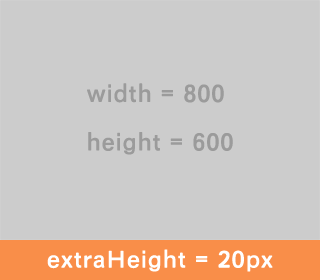

# est API Documentation

## variables

全局变量设置。

### `@support-old-ie`

是否添加支持IE 6/7相关的代码。

默认值：`true`。


### `@support-html5`

是否添加支持HTML5新元素相关的代码。

默认值：`true`。


### `@default-font-size`

默认的字体大小（以像素为单位），请确保其和`html`元素的字体大小一致（单位可以不一致，例如`100% = 16px`）。

默认值：`16`。


### `@default-text-color`

默认的文字颜色。

默认值：`#666`。


### `@default-input-placeholder-color`

文本输入框占位文字的默认颜色。

默认值：`#999`。


### `@default-base-font-family`

默认的普通字体族。

默认值： `'Helvetica Neue', Arial, sans-serif`。


### `@default-heading-font-family`

默认的标题字体族。

默认值： `'Helvetica Neue', Arial, 'Hiragino Sans GB', 'Hiragino Sans GB W3', 'Microsoft Yahei', 'WenQuanYi Micro Hei', sans-serif`。


### `@default-old-ie-heading-font-family`

IE7以下的默认的标题字体族。IE7以下在匹配到第一个字体后，不会根据字符再在font-family列表中进行fallback。

默认值： `'Microsoft Yahei', Arial, sans-serif`。


### `@default-code-font-family`

默认的代码字体。

默认值：`Monaco, Consolas, monospace`。


### `@default-border-radius`

默认的圆角半径。

默认值：`5px`。


### `@default-box-shadow`

默认的元素阴影。

默认值：`0 1px 3px rgba(0, 0, 0, 0.25)`。


### `@header-z-index`

页头的默认z-index。

默认值：`1000`。


### `@footer-z-index`

页脚的默认z-index。

默认值：`1000`。


### `@modal-z-index`

浮层遮罩层的默认z-index。

默认值：`1050`。


***

## reset

基于Eric Meyer's CSS Reset。在整站中推荐使用`normalize`来初始化样式，`reset`仅建议在第三方页面局部使用。

### `.global-reset()`

进行全局reset。

***

## normalize

基于`normalize.css`，提供最基本的样式一致性及可读性。

#### 依赖于
* `variables`
* `compatibility`

### `.global-normalize()`

进行全局normalize。

***

## compatibility

提供基础的兼容性封装。

#### 依赖于
* `variables`

### `.inline-block()`

让元素表现为`display: inline-block`的状态，IE下通过`zoom: 1`近似。

### `.box-sizing()`

设定盒模型的计算方式。
```less
.box-sizing(@sizing)
```

##### 示例
```less
.box {
  .box-sizing(border-box);
}
```

### `.placeholder()`

设定文本输入框占位符的颜色。
```less
.placeholder(@color)
```
* `@color`默认为`@default-input-placeholder-color`。

### `.user-select()`

设定选区视觉显示的方式。
```less
.user-select(@type)
```

### `.opacity()`

设定不透明度。
```less
.opacity(@opacity)
```
* `@opacity`可取0-100，默认为`100`。

### `.border-radius()`

设定圆角。
```less
.border-radius(@radius)
.border-radius(@radius-x, @radius-y)
```
* `@radius-x`、`@radius-y`分别为水平和垂直方向的弧度；
* `@radius`默认值为`@default-border-radius`。

##### 示例
```less
.box-1 {
  .border-radius(5px);
}

.box-2 {
  .border-radius(3px 5px, 10px);
}
```

### `.border-top-left-radius()`
### `.border-top-right-radius()`
### `.border-bottom-right-radius()`
### `.border-bottom-left-radius()`

分别设定四个角的弧度。
```less
//以左上角为例
.border-top-left-radius(@radius)
.border-top-left-radius(@radius-x, @radius-y)
```
* `@radius`默认值为`@default-border-radius`；
* `@radius-x`、`@radius-y`分别为水平和垂直方向的弧度。

### `.box-shadow()`

设定元素的阴影，支持多个阴影。
```less
.box-shadow(@shadow, ...)
```
* `@shadow`默认值为`@default-box-shadow`。

##### 示例
```less
.box-1 {
  .box-shadow(0 0 5px rgba(0, 0, 0, 0.5));
}

.box-2 {
  .box-shadow(0 -1px 0 #000, inset 0 1px 1px rgb(255, 0, 0));
}
```

### `.transition()`

过渡（transition）设定。
```less
.transition(@transition, ...)
```
每个`@transition`的写法请参考：
* [CSS Transitions](http://dev.w3.org/csswg/css-transitions/#the-transition-shorthand-property)
* [transition - CSS|MDN](https://developer.mozilla.org/en-US/docs/Web/CSS/transition)

##### 示例
```less
.box-1 {
  .transition(background-color 1s linear);
}

.box-2 {
  .transition(height 0.5s ease, opacity 2s linear 0.5s);
}
```

### `.transition-property()`

设定过渡（transition）相关的属性。
```less
.transition-property(@property, ...)
```

##### 示例
```less
.box-1 {
  .transition-property(background-color);
}

.box-2 {
  .transition-property(height, opacity);
}
```

### `.transition-duration()`

设定过渡（transition）的持续时间。
```less
.transition-duration(@duration, ...)
```

##### 示例
```less
.box-1 {
  .transition-duration(1s);
}

.box-2 {
  .transition-duration(0.5s, 2s);
}
```

### `.transition-timing-function()`

设定过渡（transition）的时间函数。
```less
.transition-timing-function(@timing-function, ...)
```

##### 示例
```less
.box-1 {
  .transition-timing-function(linear);
}

.box-2 {
  .transition-timing-function(ease, linear);
}
```

### `.transition-delay()`

设定过渡（transition）的延迟时间。
```less
.transition-delay(@delay, ...)
```

##### 示例
```less
.box-1 {
  .transition-delay(0);
}

.box-2 {
  .transition-delay(0, 0.5s);
}
```


### `.animation()`

动画（animation）设定。
```less
.animation(@animation, ...)
```
每个`@animation`的写法请参考：
* [CSS Animations](http://dev.w3.org/csswg/css-animations/#animation-shorthand-property)
* [animation - CSS|MDN](https://developer.mozilla.org/en-US/docs/Web/CSS/animation)

##### 示例
```less
.box-1 {
  .animation(rotate 2s linear);
}

.box-2 {
  .animation(fly-in 0.5s ease-out, fade-in 0.5s ease-out);
}
```

### `.animation-name()`

设定动画（animation）对应的`@keyframes`规则名称。
```less
.animation-name(@name, ...)
```

##### 示例
```less
.box-1 {
  .animation-name(rotate);
}

.box-2 {
  .animation-name(fly-in, fade-in);
}
```

### `.animation-duration()`

设定动画（animation）的持续时间。
```less
.animation-duration(@duration, ...)
```

##### 示例
```less
.box-1 {
  .animation-duration(3s);
}

.box-2 {
  .animation-duration(0.5s, 3s);
}
```

### `.animation-timing-function()`

设定动画（animation）的时间函数。
```less
.animation-timing-function(@timing-function, ...)
```

##### 示例
```less
.box-1 {
  .animation-timing-function(linear);
}

.box-2 {
  .animation-timing-function(ease, linear);
}
```

### `.animation-iteration-count()`

设定动画（animation）的循环次数。
```less
.animation-iteration-count(@count, ...)
```

##### 示例
```less
.box-1 {
  .animation-iteration-count(5);
}

.box-2 {
  .animation-iteration-count(3, infinite);
}
```

### `.animation-direction()`

设定动画（animation）播放的正反方向。
```less
.animation-direction(@direction, ...)
```

##### 示例
```less
.box-1 {
  .animation-direction(reverse);
}

.box-2 {
  .animation-direction(normal, alternate);
}
```

### `.animation-play-state()`

设定动画（animation）的播放状态。
```less
.animation-play-state(@state, ...)
```

##### 示例
```less
.box-1 {
  .animation-play-state(paused);
}

.box-2 {
  .animation-play-state(paused, running);
}
```

### `.animation-delay()`

设定动画（animation）的播放延迟时间。
```less
.animation-delay(@delay, ...)
```

##### 示例
```less
.box-1 {
  .animation-delay(2s);
}

.box-2 {
  .animation-delay(0s, 1s);
}
```

### `.animation-fill-mode()`

设定动画（animation）的属性填充方式。
```less
.animation-fill-mode(@mode, ...)
```

##### 示例
```less
.box-1 {
  .animation-fill-mode(backwards);
}

.box-2 {
  .animation-fill-mode(forwards, both);
}
```

### `.transform()`

变换（transform）操作。
```less
.transform(@transform-function, ...)
```
每个`@transform-function`的写法请参考：
* [CSS Transforms](http://dev.w3.org/csswg/css-transforms/#transform-property)
* [transform - CSS|MDN](https://developer.mozilla.org/en-US/docs/Web/CSS/transform)

##### 示例
```less
.box-1 {
  .transform(matrix(1.0, 2.0, 3.0, 4.0, 5.0, 6.0));
}

.box-2 {
  .transform(translateX(10px), rotate(10deg), translateY(5px));
}
```

### `.transform-style`

设定变换是否支持3D。
```less
.transform-style(@style)
```

### `.transform-origin`

设定变换坐标原点。
```less
.transform-origin(@origin)
```

### `.backface-visibility`

设定3D变换后元素背面是否可见。
```less
.backface-visibility(@visibility)
```

### `.perspective`

设定透视距离。
```less
.perspective(@d)
```

### `.matrix()`
### `.translate()`
### `.translateX()`
### `.translateY()`
### `.scale()`
### `.scaleX()`
### `.scaleY()`
### `.rotate()`
### `.skew()`
### `.skewX()`
### `.skewY()`
### `.maxtrix3d()`
### `.translate3d()`
### `.translateZ()`
### `.scale3d()`
### `.scaleZ()`
### `.rotate3d()`
### `.rotateX()`
### `.rotateY()`
### `.rotateZ()`

单个变换函数的快捷方法，参数写法见[`.transform()`](#transform)中的参考文档。

### `.background-clip`

设定背景渲染范围。
```less
.background-clip(@clip, ...)
```

##### 示例
```less
.box-1 {
  .background-clip: content-box;
}

.box-2 {
  .background-clip: border-box, content-box;
}
```

### `.background-size`

设定背景渲染范围。
```less
.background-size(@size, ...)
```

##### 示例
```less
.box-1 {
  .background-size: cover;
}

.box-2 {
  .background-size: 50% auto, contain;
}
```

***

## util

提供常用工具函数。

#### 依赖于
* `variables`

### `.clearfix()`

清除元素内部的浮动，使元素获得应有的高度。

### `.size()`

设定元素尺寸。
```less
.size(@side-length)
.size(@width, @height)
```
* 只有一个参数时，元素为正方形，边长为`@side-length`；
* 有两个参数时，`@width`和`@height`分别为宽高。

### `.no-bullet()`
[DEPRECATED]用于去掉列表样式的“弹头”，推荐使用`reset-list-style`替代它。
```less
.no-bullet();
.no-bullets();
```

#### 示例
```html
<ul>
  <li class="est-no-bullet">
    <a href="#">Some list</a>
  </li>
</ul>
<ul class="est-no-bullets">
  <li>
    <a href="#">Some list</a>
  </li>
</ul>
```
```less
.est-no-bullet {
  .no-bullet();
}
.est-no-bullets {
  .no-bullets();
}
```

### `.margin-em()` & `.padding-em()`
用于辅助计算margin和padding的em值
```less
.margin-em(14px);
.margin-em(14);
.margin-top-em(14px);
.margin-top-em(14);
.margin-right-em(14px);
.margin-right-em(14);
.margin-bottom-em(14px);
.margin-bottom-em(14);
.margin-left-em(14px);
.margin-left-em(14);
.padding-em(14px 28px);
.padding-em(14 28);
.padding-top-em(14px);
.padding-top-em(14);
.padding-right-em(14px);
.padding-right-em(14);
.padding-bottom-em(14px);
.padding-bottom-em(14);
.padding-left-em(14px);
.padding-left-em(14);
```
* 这些方法的参数与其对应的CSS属性的样式类似，但只能是像素大小（单位可选）


### `.margin-rem()` & `.padding-rem()`
用于辅助计算margin和padding的rem值
```less
.margin-rem(14px);
.margin-rem(14);
.margin-top-rem(14px);
.margin-top-rem(14);
.margin-right-rem(14px);
.margin-right-rem(14);
.margin-bottom-rem(14px);
.margin-bottom-rem(14);
.margin-left-rem(14px);
.margin-left-rem(14);
.padding-rem(14px 28px);
.padding-rem(14 28);
.padding-top-rem(14px);
.padding-top-rem(14);
.padding-right-rem(14px);
.padding-right-rem(14);
.padding-bottom-rem(14px);
.padding-bottom-rem(14);
.padding-left-rem(14px);
.padding-left-rem(14);
```
* 这些方法的参数与其对应的CSS属性的样式类似，但只能是像素大小（单位可选）

***

## layout

提供常见的基础布局。

#### 依赖于
* `variables`
* `compatibility`
* `util`

### `.est-layout-fixed-header`

定高、相对视口固定页头布局。
```less
.est-layout-fixed-header(@height)
```
* 页头的`z-index`默认为`@header-z-index`；
* `est-header`、`est-body`为布局保留类名。

##### 示例
```html
<body>
  <div class="est-header"></div>
  <div class="est-body"></div>
</body>
```
```less
@import "normalize";

.global-normalize();

body {
  .est-layout-fixed-header(80px);
}
```

### `.est-layout-fixed-footer`

定高、相对视口固定页脚布局。
```less
.est-layout-fixed-footer(@height)
```
* 页脚的`z-index`默认为`@footer-z-index`；
* `est-body`、`est-footer`为布局保留类名。

##### 示例
```html
<body>
  <div class="est-body"></div>
  <div class="est-footer"></div>
</body>
```
```less
@import "normalize";

.global-normalize();

body {
  .est-layout-fixed-footer(80px);
}
```

### `.est-layout-sticky-footer`

当内容高度小于容器时也有显示在底部的固定高度页脚，内容高于容器后页脚会被挤压到视口外。
```less
.est-layout-sticky-footer(@height)
```
* `est-body`、`est-footer`为布局保留类名；
* 不能与其他布局混用。

##### 示例
```html
<body>
  <div class="est-body">
    <div>Content</div>

    <!-- @support-old-ie为true时需要下面的占位容器 -->
    <div class="est-footer-placeholder"></div>
  </div>
  <div class="est-footer"></div>
</body>
```
```less
@import "normalize";

.global-normalize();

html,
body {
  height: 100%;
}

body {
  .est-layout-sticky-footer(100px);
}
```

### `.est-layout-page`

定宽剧中页面布局。
```less
.est-layout-page(@width)
```

##### 示例
```html
<body>
  <div class="page"></div>
</body>
```
```less
@import "normalize";

.global-normalize();

.page {
  .est-layout-page(980px);
}
```

### `.est-layout-sidebar()`

支持左右两侧各最多一个定宽（可以是px/em/%）侧边栏，主内容区域填充剩余宽度。
```less
.est-layout-sidebar(left, @width)
.est-layout-sidebar(right, @width)
.est-layout-sidebar(@primary-width, @secondary-width)
```
* 当有两个侧边栏时，`@primary-width`为左侧宽度，`@secondary-width`为左侧宽度；
* `est-sidebar`、`est-sidebar-primary`、`est-sidebar-secondary`为布局保留类名。

##### 示例（左侧边栏）
```html
<body>
  <div class="est-main"></div>
  <div class="est-sidebar"></div>
</body>
```
```less
@import "normalize";

.global-normalize();

body {
  .est-layout-sidebar(left, 200px);
}
```


##### 示例（双侧边栏）
```html
<body>
  <div class="est-main"></div>
  <div class="est-sidebar-primary"></div>
  <div class="est-sidebar-secondary"></div>
</body>
```
```less
@import "normalize";

.global-normalize();

body {
  .est-layout-sidebar(200px, 150px);
}
```

### `.est-layout-popup()`

弹出层布局。
```less
.est-layout-popup(@position, @overlay-opacity)
```
* `@position`可取`top`/`right`/`bottom`/`left`/`center`，分别对应在视口顶部居中/右侧居中/底部居中/左侧居中/绝对居中；
* `@overlay-opacity`为遮罩层的不透明度，取值为0-100，如果为0则遮罩不显示，可以与弹出层周围的页面内容进行交互，否则则无法交互，默认值为0；
* 遮罩层的`z-index`默认值为`@modal-z-index`；
* `est-popup`为布局保留的类名。

##### 示例
```html
<body>
  <div>Content</div>
  <div class="overlay">

    <!-- @support-old-ie为true时需要下面的占位容器 -->
    <div class="est-valign-ghost"></div>

    <div class="est-popup">Popup Content</div>
  </div>
</body>
```
```less
.overlay {
  .est-layout-popup(center, 80);
}
```


### `.est-layout-horizontal-list()`

用于把列表变成水平，在做菜单样式或是卡片样式时有用。

```less
.est-layout-horizontal-list(@gap, @direction: left)
```

* `@gap`参数表示水平方向上列表项之间的间隔长度（任意单位），必填；
* `@direction`参数表示水平浮动的方向，可选。默认为`left`。可选指为`right`/`left`；


### `.est-layout-fluid-fixed-ratio()`

在自适应宽度情况下，确保视频、flash、图片、iframe或`class`为`.est-fixed-ratio`的元素高宽比固定。如下图所示：



width和height是固定比例的高宽比，随着容器的变化而变化，extraHeight是额外的固定高度，不会随容器宽度变化而变化。

```less
.est-layout-fluid-fixed-ratio(@width, @height, @extraHeight);
```

* `@width`参数表示宽度，必填
* `@height`参数表示高度，必填
* `@extraHeight`参数表示除宽度比外，额外的固定高度，这部分高度不会随宽度的变化而变化

##### 示例
[DEMO地址](http://cdpn.io/khIqH)

***

## Typography

### 依赖于

* `util`

### `.font-family()`

按全局设定输出字体族设定。
```less
.font-family(@type)
```
* `@type`为字体类型，目前提供`base`/`heading`/`code`三类，分别对应普通文本、标题、代码。

#### 示例
```less
.est-text {
    .font-family(heading);
}
```


### `.ellipsis()`

省略号样式，当文字超过容器宽度时，超出部分文字隐藏并显示省略号。提供单行省略号和多行省略号（只支持webkit内核）两种mixin。
```less
.ellipsis()             // 单行省略号
.ellipsis(@line-number) // 多行省略号
```
* `@line-number`参数输入为数字字，表示最多可显示的行数。

##### 示例
```html
<div class="est-ellipsis-3">
    <div class="est-ellipsis">我在人民广场吃着炸鸡腿。</div>
    那年冬天，祖母死了，父亲的差使也交卸了，正是祸不单行的日子。我从北京到徐州，打算跟着父亲奔丧回家。到徐州见着父亲，看见满院狼藉的东西，又想起祖母，不禁簌簌地流下眼泪。父亲说：“事已如此，不必难过，好在天无绝人之路！”
</div>
```
```less
.est-ellipsis {
    width: 50px;
    .ellipsis();
    background-color: #fee9cc;
}
.est-ellipsis-3 {
    width: 300px;
    .ellipsis(3);
}
```

### `.force-wrap()`

用于阻止长字符串（例如url或无意义连续英文字符）打破布局。
```less
.force-wrap();
```

##### 示例
```html
<div class="est-force-wrap">世界上最长的人名：Llanfairpwllgwyngyllgogerychwyrndrobwllllantysiliogogogoch</div>
<div>世界上最长的人名：Llanfairpwllgwyngyllgogerychwyrndrobwllllantysiliogogogoch</div>
```
```less
.est-force-wrap {
    .force-wrap();
    background-color: #fee9cc;
}
```

### `.hide-text()`

用于隐藏元素内文字的mixin，一般在文字隐藏之后使用背景图片替代显示。如果使用此mixin的元素是inline-block元素，请确保其设置了宽度。
```less
.hide-text();
```

#### 示例
```html
<div>隐藏链接地址（inline-block）：<a href="#" class="est-hide-text">http://www.baidu.com</a></div>
```
```less
.est-hide-text {
    .hide-text();
    .inline-block();
    background-color: #fee9cc;
    width: 100px;
}
```


### `.invisible()`

用于隐藏整个元素，一般处理那些仅仅用于增加可访问性的文字或元素。
```less
.invisible();
```


#### 示例
```html
<a href="#" class="est-invisible">http://www.baidu.com</a>
```
```less
.est-invisible {
    .invisible();
}
```


### `.img-replace`

用图片替换文字，通常用作类似icon的样式。同时提供了一个简写`.ir`。
```less
.img-replace(@img-url, @img-x, @img-y);
.ir(@img-url, @img-x, @img-y);
```
* `@img-url`参数是字符串格式的背景图片路径;
* `@img-x`参数是`background-position`中的水平方向位置，可选值为`top`/`center`/`bottom`/`n%``npx`。默认为0;
@ `@img-y`参数是`background-position`中的垂直方向位置，可选值为`left`/`center`/`right`/`n%``npx`。默认为0;


#### 示例
```html
<div class="est-img-replace">http://www.baidu.com</div>
```
```less
.est-img-replace {
    .inline-block();
    .img-replace('http://www.baidu.com/img/bdlogo.gif', -106px, -30px);
    width: 55px;
    height: 60px;
}
```


### `.font-size-rem()`/`.font-size-em()`

`font-size-rem`与`font-size-em`用于辅助计算字体的[em和rem](https://developer.mozilla.org/en-US/docs/Web/CSS/length)值。他们都依赖于配置项`@default-font-size`，请确保`HTML`标签的字体大小与`@default-font-size`一致。
```less
.font-size-rem(@px-size);
.font-size-rem(@px-size, @context-font-size);
```
* `@px-size`参数是字体大小，单位是像素。可以是纯数字`14`，也可是`14px`，它们的效果一致；
* `@context-font-size`参数是上下文的字体大小，单位为像素。输入格式与`@px-size`一致。默认值为`@default-font-size`；

#### 示例
```html
<div class="est-font-size-em">
    http://www.baidu.com
    <div class="est-font-size-rem">http://www.baidu.com</div>
</div>
```
```less
.est-font-size-em {
    .font-size-em(32px);
}
.est-font-size-rem {
    .font-size-rem(32px);
}
```

#### `.font-face()`

`.font-face`提供了一种更方便地书写font-face样式的mixin。
```less
.font-face(@family-name, @font-path, @font-weight, @font-style, @include-svg);
```
* `@family-name`参数是`font-family`样式的值，必填；
* `@font-path`参数是字体的路径，必填；
* `@font-weight`参数表示字体的组系，默认值为`normal`；
* `@font-style`参数表示字体的风格，默认值为`normal`；
* `@include-svg`参数表示是否使用svg格式的字体，默认值为`false`；

#### 示例
```less
.font-face('FamilyName', '/some/font/url');
// 输出为
/* Example output: */
@font-face {
    font-family: 'FamilyName';
    src: url('/some/font/url.eot');
    src: url('/some/font/url.eot?#iefix') format('embedded-opentype'),
         url('/some/font/url.woff') format('woff'),
         url('/some/font/url.ttf') format('truetype');
    font-weight: normal;
    font-style: normal;
}
```

### `.hover-link()`

用于实现链接默认无下划线，hover后有下划线的样式。
```less
.hover-link();
```

#### 示例
```html
<a href="#" class="est-hover-link">http://www.baidu.com</a>
```
```less
.est-hover-link {
    .hover-link();
}
```

### `.unstyled-link()`

用于将链接变成默认的文字样式。
```less
.unstyled-link();
```

#### 示例
```html
<a href="#" class="est-unstyled-link">http://www.baidu.com</a>
```
```less
.est-unstyled-link {
    .unstyled-link();
}
```

### `.drop-cap()`

用于实现文字下沉样式，提供了两种mixin分别实现“首字下沉”和“多字下沉”。
```less
.drop-cap(@line-height, @lines, @margin-right);
.drop-cap-inline(@context-line-height, @lines, @margin-right);
```
* `@line-height`参数表示行高，必填。单位可选`%`/`px`/`em`，或者直接使用缩放因子，例如：`2`；
* `@lines`参数表示下沉的行数，可选。默认为两行。输入格式为数字；
* `@margin-right`参数表示“下沉文字”与普通文字的间隔，可选。默认为`1em`（相对于普通字体的大小）；
* `@context-line-height`参数表示上下文的行高，必填；

#### 示例
```html
<div class="est-drop-cap-context">
    <div class="est-drop-cap">
        <a href="#">百度</a>（Nasdaq简称：BIDU）是全球最大的中文搜索引擎，2000年1月由李彦宏、徐勇两人创立于北京中关村，致力于向人们提供“简单，可依赖”的信息获取方式。“百度”二字源于中国宋朝词人辛弃疾的《青玉案·元夕》词句“众里寻他千百度”，象征着百度对中文信息检索技术的执著追求。
    </div>
    <div class="est-drop-cap-2">
        1999年底，身在美国硅谷的李彦宏看到了中国互联网及中文搜索引擎服务的巨大发展潜力，抱着技术改变世界的梦想，他毅然辞掉硅谷的高薪工作，携搜索引擎专利技术，于2000年1月1日在中关村创建了百度公司。从最初的不足10人发展至今，员工人数超过18000人。如今的百度，已成为中国最受欢迎、影响力最大的中文网站。
    </div>
    <div>
        <span class="est-drop-cap-inline">百度拥有数千名研发工程师</span>，这是中国乃至全球最为优秀的技术团队，这支队伍掌握着世界上最为先进的搜索引擎技术，使百度成为中国掌握世界尖端科学核心技术的中国高科技企业，也使中国成为美国、俄罗斯、和韩国之外，全球仅有的4个拥有搜索引擎核心技术的国家之一。
    </div>
</div>
```
```less
.est-drop-cap-context {
    font-size: 1em;
    line-height: 24px;
}
.est-drop-cap {
    .drop-cap(24px);
}
.est-drop-cap-2 {
    .drop-cap(24px, 3, 10px);
}
.est-drop-cap-inline {
    .drop-cap-inline(24px, 2);
}
```

### `.rhythm()`
用于按照“[垂直的旋律](http://blog.justfont.com/2012/08/%E7%B6%B2%E9%A0%81%E6%8E%92%E7%89%88%EF%BC%9A%E6%B9%AF%E5%93%81%EF%BC%8D%EF%BC%8D%E5%9E%82%E7%9B%B4%E7%9A%84%E9%9F%BB%E5%BE%8B/)”来排版文字，适合中文阅读。一般用于多段文字（文章）的显示。
```less
.rhythm(@font-size, @line-height);          // 规范化作用域内所有块级元素的上下边框、行高、字体大小，使其符合“垂直的旋律”

// 以下mixin是附属功能，只能在使用`.rhythm`之后使用（必须处于同一个域）
// 基础高度(px) = 行高 / 2;

.rhythm-line-height(@lines);                // 设置行高为 (n * 基础高度 * 2)
.rhythm-margin(@lines);                     // 设置上下外边距为 (n * 基础高度)
.rhythm-margin-top(@lines);                 // 设置上外边距为 (n * 基础高度)
.rhythm-margin-bottom(@lines);              // 设置下外边距为 (n * 基础高度)
.rhythm-padding(@lines, @border);           // 设置上下内边距为 (n * 基础高度) - 边框宽度，同时设置上边框
.rhythm-padding-top(@lines, @border);       // 设置上内边距为 (n * 基础高度) - 边框宽度，同时设置上边框
.rhythm-padding-bottom(@lines, @border);    // 设置下内边距为 (n * 基础高度) - 边框宽度，同时设置上边框
```
* `@font-size`参数表示文字的大小，可选。默认为14px。此参数必须以像素为单位；
* `@line-height`参数表示行高的大小，可选。默认为1.8。单位可选`%`/`px`/`em`，或者直接使用缩放因子，例如：`2`；
* `@lines`参数表示行数，可选。默认值为1。输入格式为纯数字。
* `@border`参数表示边框的样式，可选。默认值为false（表示不加边框）。输入格式为：`npx solid #CCC`，边框宽度必须以像素为单位；

#### 示例
```html
<div class="entry">
    <h1>标题一</h1>
    <h2>标题二</h2>
    <h3>标题三</h3>
    <h4>标题四</h4>
    <h5>标题五</h5>
    <h6>标题六</h6>
    <blockquote>字型排版學中的空間就像是音樂中的時間。空間可以被切成無限多塊，但在設計上，只要一些合於比例的間隙，卻比一大堆任意而無理的切割還有用許多。</blockquote>
    <div>這句話完整詮釋了「垂直的韻律」(Vertical Rhythm)在字型排版上的用處：在音樂中，好的節奏遠比隨意加之的額外裝飾還要來得重要；</div>
    <p>而在排版中，若每個區塊間的距離符合固定比例，那麼這段文章看起來就會很有韻律感，版面整齊、好看以外，更增加了可閱讀性，讓讀者更願意花長時間閱讀。祕訣就在以「基本行距」為單位決定版面上各區塊的距離。</p>
</div>
```
```less
.entry {
    .rhythm(14px, 2);
    blockquote {
        .rhythm-margin(1);
        .rhythm-padding(1, 1px solid #CCC);
    }
    p {
        .rhythm-line-height(2);
        .rhythm-margin(2);
        .rhythm-padding(2);
        background: #fee9cc;
    }
}
```


## Effects

预设视觉效果。

### 依赖于

* `variables`
* `compatibility`
* `util`

### `.embossed-text()`

文字浮凸效果。
```less
.embossed-text(@bg-color)
.embossed-text(@bg-color, @fg-color)
```
* `@bg-color`为文字所在区域的背景色；
* `@fg-color`为文字前景色，不填则根据背景生成。

#### 示例
```less
.est-blind-embossed {
    .embossed-text(lightblue);
}

.est-embossed {
    .embossed-text(lightblue, #6699CC);
}
```

### `.debossed-text()`

文字凹陷效果。

```less
.debossed-text(@bg-color)
.debossed-text(@bg-color, @fg-color)
```
* `@bg-color`为文字所在区域的背景色；
* `@fg-color`为文字前景色，不填则根据背景生成。

#### 示例
```less
.est-blind-debossed {
    .debossed-text(lightblue);
}

.est-debossed {
    .debossed-text(lightblue, #6699CC);
}
```

### `.3d-text()`

3D文字效果。

```less
.3d-text(@color)
```
* `@color`为文字颜色。

#### 示例
```less
.est-3d {
    .3d-text(#FFFFFF);
}
```

### `.glow-text()`

文字发光效果。

```less
.glow-text(@radius)
.glow-text(@color, @radius)
```
* `@color`为文字颜色，不填则发光颜色为文字颜色；
* `@radius`为发光半径，默认值为`5px`。

#### 示例
```less
.est-glow-1 {
    .glow-text(10px);
}

.est-glow-2 {
    .glow-text(gold, 20px);
}
```

### `.blurry-text()`

文字模糊效果。

```less
.blurry-text(@color, @radius)
```
* `@color`为文字颜色；
* `@radius`为模糊半径，默认值为`0.15em`。

#### 示例
```less
.est-blurry {
    .blurry-text(#FFFFFF);
}
```
